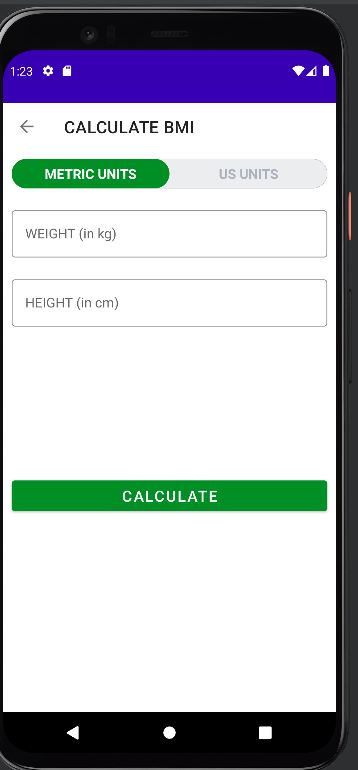

# WorkOutApp

* This is a 7 Minute workout application that contains 12 exercises 30 seconds each for fitness.
* You can check your BMI.
* You can also check your previous exercises log/history.
* It also read the exercise for blind people.

 

# Landing Page

* Here You can either check your BMI or history or start a your today's workout.
 

 

# BMI Calculator

* This is the BMI Calculator here you can check your BMI either in metric units or US units.
* You will get your BMI after entering your height and weight.

 

# History 

* This is the history log of your exercises all the exercises you have done you can see here.
* It uses Room Database to store your previous exercises data.

 

# Exercises 

* Now, here is the exercise page.
* At the center of the screen, you can see the Exercise you are going to perform 
* Then below it, there is a timer which is 30 sec for every activity.
* Then at the bottom of the screen, you can see how many exercises you have done and how many left.

 

# Finished

* Congratulations You have completed the 7-minute workout.
* Now either continue a new workout or close the app.

